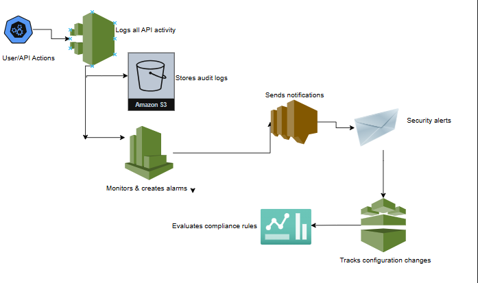
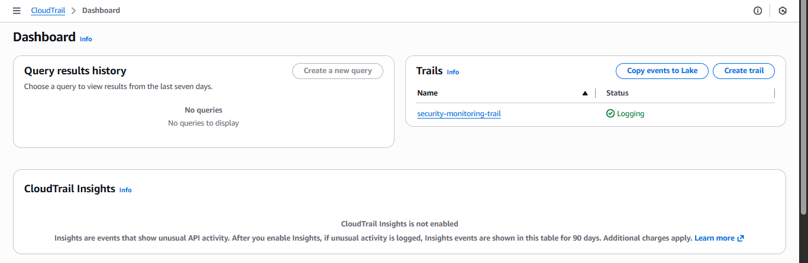
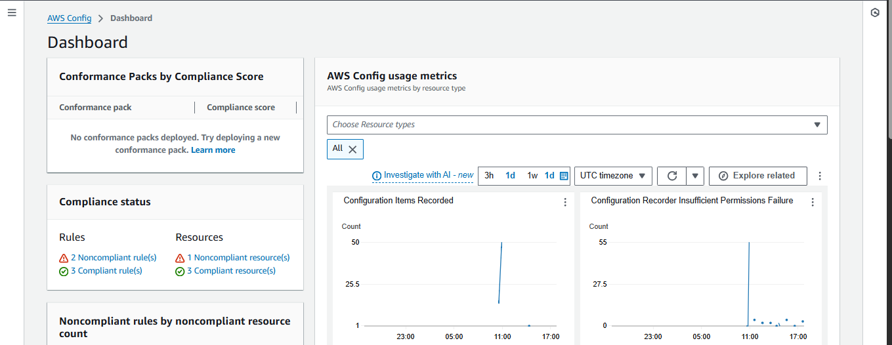

# aws-cloud-security-monitoring
SOC-style Cloud Security monitoring using AWS CloudWatch

## Overview
Built a comprehensive security monitoring infrastructure on AWS to track API activity, detect configuration changes, and send real-time alerts for security events.

## Architecture


## Services Used
- **AWS CloudTrail** - Logs all API activity across the AWS account
- **AWS Config** - Tracks resource configuration changes and compliance
- **Amazon CloudWatch** - Creates alarms based on security events
- **Amazon SNS** - Sends email notifications for security alerts
- **Amazon S3** - Stores CloudTrail logs securely

## Project Goals
- Implement security best practices for AWS infrastructure
- Create centralized logging and monitoring
- Detect and alert on suspicious activities
- Ensure configuration compliance

## Implementation Details

### 1. CloudTrail Configuration
- Enabled a multi-region CloudTrail trail named `security-monitoring-trail`
- Configured S3 bucket for secure log storage
- Enabled log file validation for integrity
- Set up CloudWatch Logs integration
*CloudTrail provides a complete audit trail of all API calls, which is essential for security monitoring and compliance.



### 2. AWS Config Setup
- Enabled AWS Config to track resource configurations
- Implemented 3 compliance rules:
  - `s3-bucket-public-read-prohibited` - Detects publicly accessible S3 buckets
  - `s3-bucket-public-write-prohibited` - Prevents public write access
  - `restricted-ssh` - Monitors security groups for unrestricted SSH access
- Config continuously monitors resources and flags non-compliant configurations before they become security issues.



### 3. CloudWatch Alarms & Monitoring
- Created metric filter to detect root account usage
- Set up CloudWatch alarm to trigger on root account activity
- Configured alarm to send notifications via SNS

**Filter pattern used:**
```
{ $.userIdentity.type = "Root" && $.userIdentity.invokedBy NOT EXISTS && $.eventType != "AwsServiceEvent" }
```

**Why it matters:**
Root account usage should be rare and monitored closely. This alarm ensures I'm notified immediately if the root account is used.


### 4. SNS Email Notifications
- Created SNS topic named `security-alerts`
- Subscribed my email address to receive notifications
- Tested alert delivery by triggering alarms
*Real-time notifications ensure security events don't go unnoticed.

## Security Use Cases Covered
- Detects unauthorized root account usage
- Alerts on insecure S3 bucket configurations
- Monitors security group changes exposing SSH (port 22)
- Provides audit trails for incident response

## What I Learned

### Best Practices
- The importance of centralized logging for security
- How to detect and respond to security events
- Cost-effective ways to implement security monitoring
- The principle of least privilege in IAM configurations

### Cloud Security Concepts
- Defense in depth strategy
- Continuous compliance monitoring
- Audit trail importance for incident response
- Real-time alerting vs. periodic review

## Future Improvements
If I expand this project, I would add:

1. **Amazon GuardDuty** - Intelligent threat detection using machine learning
2. **AWS Security Hub** - Centralized security findings from multiple services
3. **Automated Remediation** - Lambda functions to automatically fix non-compliant resources
4. **Custom Dashboard** - CloudWatch dashboard visualizing security metrics
5. **Log Analysis** - Amazon Athena to query CloudTrail logs for security insights
6. **Multi-account setup** - Implement across multiple AWS accounts using AWS Organizations

## How to Replicate This Project

### Prerequisites
- AWS account with Free Tier credits
- Basic understanding of AWS services
- Email address for SNS notifications

### Steps
1. Enable CloudTrail with multi-region trail
2. Set up AWS Config with compliance rules
3. Create CloudWatch metric filter for root account usage
4. Create SNS topic and email subscription
5. Create CloudWatch alarm linked to SNS topic
6. Test by performing monitored actions
7. Verify email alerts are received

### Estimated Time
- 2-3 hours for initial setup
- Additional time for testing and documentation

## Skills Demonstrated
- Cloud security monitoring (SOC-style)
- AWS CloudTrail & CloudWatch log analysis
- Security alerting and incident detection
- Configuration compliance and auditing
- AWS IAM security best practices

## Conclusion
This project demonstrates a foundational security monitoring setup that provides visibility into AWS activities, ensures configuration compliance, and alerts on suspicious behavior. The skills learned here are directly applicable to real-world cloud security roles.
